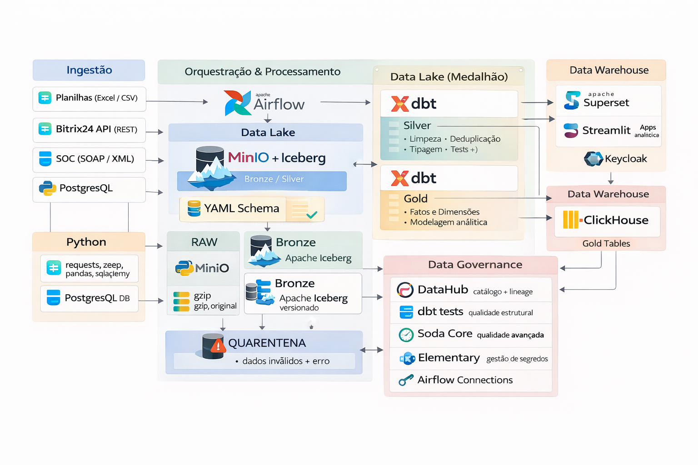

# Data Platform — Open Source Lakehouse

Plataforma de dados 100% open source, containerizada com Docker e baseada em arquitetura **Medallion (Raw → Bronze → Silver → Gold)**. Suporta ingestão multi-fonte, contratos de schema explícitos, qualidade de dados integrada e governança.

---

## Arquitetura



---

## Stack Tecnológica

| Categoria           | Tecnologia                              |
|---------------------|-----------------------------------------|
| Infraestrutura      | Docker + Docker Compose                 |
| Orquestração        | Apache Airflow                          |
| Ingestão            | Python (pandas, requests, psycopg2)     |
| Armazenamento       | MinIO (S3-compatible)                   |
| Formato de arquivo  | Apache Parquet                          |
| Lakehouse           | Apache Iceberg (versionamento, time travel) |
| Transformação       | dbt                                     |
| Query Engine (Dev)  | DuckDB                                  |
| Data Warehouse      | ClickHouse (camada Gold)                |
| BI                  | Apache Superset                         |
| Aplicações          | Streamlit                               |
| Qualidade           | dbt tests + Soda Core                   |
| Observabilidade     | Elementary                              |
| Secrets             | Airflow Connections                     |

---

## Camadas de Dados

### Raw
- Arquivos originais comprimidos (gzip) preservados sem modificação
- Retenção: 14 dias
- Armazenamento: MinIO exclusivamente
- Objetivo: trilha de auditoria e reprocessamento

### Bronze
- Tabelas Iceberg Parquet com colunas de controle (`_ingested_at`, `_source`, `_batch_id`)
- Dados imutáveis — sem deleção ou update
- Retenção: 30 dias
- Falhas isoladas em partição de **quarentena** — pipeline não interrompe

### Silver
- Transformações dbt: deduplicação, consistência de tipos, normalização
- Testes de qualidade obrigatórios (not_null, unique, accepted_values)
- Schema versionado via YAML

### Gold
- Modelos analíticos (fatos e dimensões) publicados no ClickHouse
- Monitoramento de SLA por fonte e camada
- Consumo via Superset e Streamlit

---

## Princípios do Projeto

- **Preservação**: dado original sempre mantido na camada Raw
- **Imutabilidade**: Bronze via Apache Iceberg
- **Isolamento de falhas**: quarentena não paralisa o pipeline
- **Contratos explícitos**: schemas definidos em YAML
- **Segredos centralizados**: Airflow Connections
- **SLAs mensuráveis**: por camada e por fonte
- **Reprocessamento previsível**: backfill documentado
- **Transformações versionadas**: dbt com controle de versão

---

## Estrutura do Projeto

```
data-platform/
├── dags/                        # DAGs Airflow
│   ├── ingestion/               # Módulos de ingestão
│   │   └── postgres_pipeline.py # Pipeline PostgreSQL
│   ├── ingest_postgres.py       # DAG principal de ingestão
│   ├── dbt_silver.py            # DAG transformação Silver
│   └── dbt_gold.py              # DAG transformação Gold
├── dbt/                         # Projeto dbt
│   ├── models/
│   │   ├── staging/             # Views staging (Silver Staging)
│   │   └── marts/               # Tabelas mart (Silver)
│   ├── macros/
│   └── dbt_project.yml
├── docker/                      # Configuração Docker
│   ├── services/                # Serviços modulares (compose)
│   ├── docker-compose.yml
│   └── dbt.Dockerfile
├── docs/                        # Documentação
│   ├── Arquitetura_projeto.png  # Diagrama de arquitetura
│   └── PRD_Lakehouse_v2_Final.docx
├── schemas/                     # Contratos de schema (YAML)
│   └── postgres_orders.yml
├── tests/                       # Testes automatizados (pytest)
│   ├── test_normalize.py
│   ├── test_paths.py
│   ├── test_schema.py
│   ├── test_state.py
│   └── test_validate.py
├── requirements.txt
└── pyproject.toml
```

---

## Fontes de Ingestão Suportadas

| Fonte           | Método              |
|-----------------|---------------------|
| PostgreSQL      | psycopg2 / SQLAlchemy |
| REST APIs       | requests            |
| SOAP / XML      | zeep                |
| Planilhas       | pandas              |
| CSV             | pandas              |

---

## Como Executar

### Pré-requisitos
- Docker + Docker Compose instalados
- (Opcional) Python 3.10+ para testes locais

### Subindo o ambiente

```bash
cd docker
docker compose up -d
```

### Acessos

| Serviço          | URL                        | Credenciais padrão     |
|------------------|----------------------------|------------------------|
| Airflow          | http://localhost:8080      | admin / admin          |
| MinIO Console    | http://localhost:9001      | minioadmin / minioadmin |
| Superset         | http://localhost:8088      | admin / admin          |
| ClickHouse       | http://localhost:8123      | —                      |

### Executando os testes

```bash
pip install -r requirements.txt
pytest
```

---

## Fases de Implementação

| Fase     | Escopo                                                        | Status       |
|----------|---------------------------------------------------------------|--------------|
| Fase 1   | MVP — ingestão PostgreSQL, camadas Raw/Bronze/Silver/Gold, dbt | Em andamento |
| Fase 2   | Apps Streamlit + autenticação Keycloak SSO                    | Planejado    |
| Fase 3   | DataHub — governança e catálogo de dados                      | Planejado    |

---

## Schema Contract (YAML)

Todos os schemas de ingestão seguem o padrão:

```yaml
source: postgres
entity: orders
version: "1.0"

fields:
  - name: id
    type: integer
    required: true
  - name: status
    type: string
    required: true

on_unknown_fields: warn
```

Schemas ficam em `schemas/` e são validados automaticamente pela pipeline de ingestão.

---

## Contribuindo

1. Crie uma branch a partir de `main`
2. Implemente seguindo os padrões da stack
3. Garanta que `pytest` passa sem erros
4. Abra um Pull Request descrevendo as mudanças

---

## Licença

Projeto interno. Todos os componentes utilizam licenças open source (Apache 2.0 / MIT).
